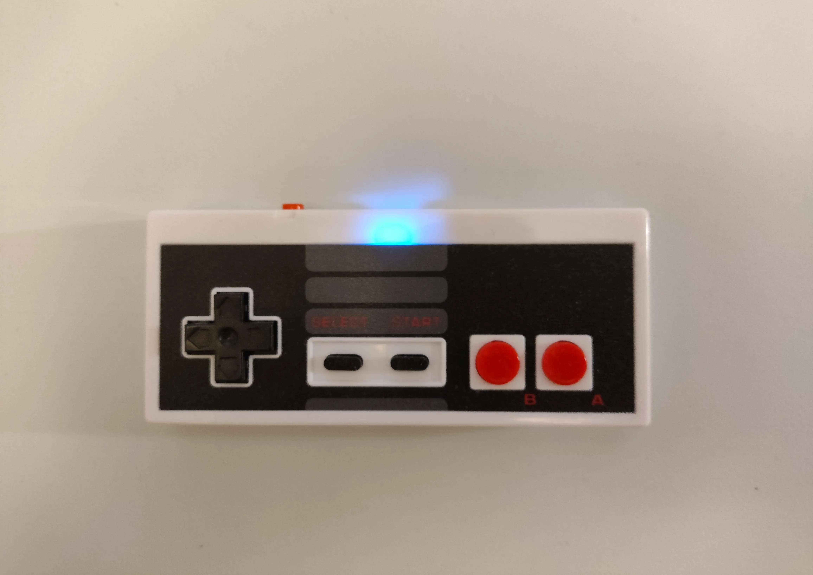
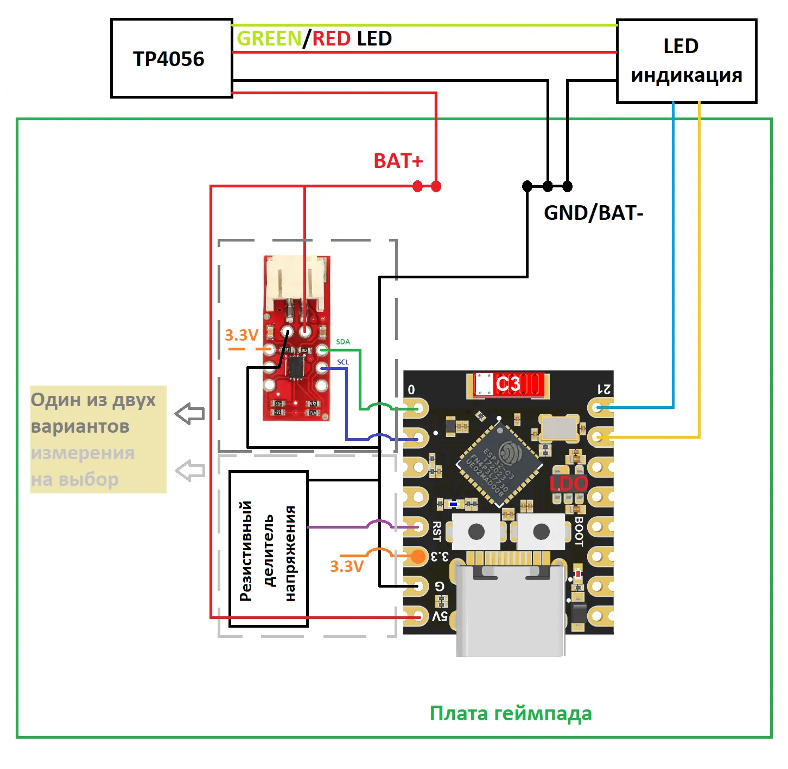
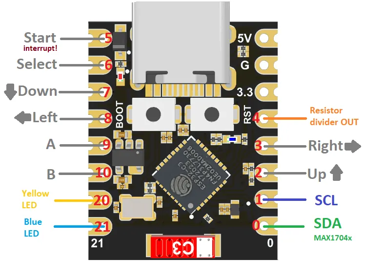

# 🎮 BLE Gamepad на ESP32

Opensource беспроводной геймпад на базе ESP32 с поддержкой Bluetooth Low Energy (BLE) HID. Проект является развитием [HC-05_BT-HID_retro_gamepad](https://github.com/NoileExe/HC-05_BT-HID_retro_gamepad), переписанным под современную платформу.  

В прошлом проекте я использовал связку Arduino Pro Mini + модуль HC-05 с прошивкой RN-42. Это работало, но требовало внешнего BT-модуля со своими минусами: старый стек, трудоёмкая прошивка и проблемы с приобретением качественных модулей.  

Этот проект — результат постепенного переноса наработок, экспериментов с точным мониторингом батареи и адаптации под реалии современного embedded-стека (C++17, PlatformIO, NimBLE).  

  
*Прототип беспроводного геймпада **(NES исполнение)***  

## ⚠️ Важные замечания о текущем состоянии проекта

Прежде чем начинать знакомство с проектом, важно понимать его текущие ограничения:

- **Только цифровые геймпады.** Поддержка аналоговых стиков и триггеров находится в стадии заготовок и на данный момент не реализована полноценно.
- **Протестировано только на доноре NES.** В реальном железе пока проверен только самый простой вариант — проводной геймпад NES Classic Mini. Остальные требуют дописывания кода и дополнительной конфигурации GPIO.
- **Только ESP32-C3 SuperMini (4 МБ).** Код реализован и протестирован исключительно под эту плату. На ней в текущей конфигурации **закончились свободные GPIO** — дальнейшее расширение функционала (стики, дополнительные кнопки) потребует пересмотра архитектуры железа или переход на другой тип платы.
- **Нет программного режима сна.** Устройство в активном состоянии потребляет **~80 мА постоянно**, поэтому для отключения **требуется физический выключатель**. Реализация Deep Sleep с сохранением BLE-сопряжения — в планах (см. `CHANGELOG.md` → `[Unreleased]`).
- **Развивающийся проект.** Конфигурация платы, распиновка и структура кода могут существенно меняться между версиями.


## ✨ Особенности
- **Универсальный HID-профиль**: поддержка Generic Gamepad и XBox (One S / Series X) режимов
- **Три режима кнопок**: Standard / Turbo / Slow со сменой по комбинации кнопок (удержание 3 сек): **D-Pad UP + A + B**
- **Два варианта мониторинга батареи** (переключаются дефайном):
  - **HW v1.1**: резисторный делитель на GPIO-4 (ADC1)
  - **HW v1.2**: модуль на базе микросхем MAX1704x (I2C: SDA=GPIO-0, SCL=GPIO-1)
- **Умная стабилизация процента заряда**:
  - Защита от скачков при подключении/отключении зарядного устройства
  - Хранение состояния в RTC-памяти ESP32
- **Управление питанием**:
  - Контроль заряда каждые 60 сек
  - Световая индикация при низком заряде <10%
  - Блокирующий цикл при критически низком заряде <2% (до начала зарядки)
  - Таймер отсутствия сопряжения >2 мин (BT-модуль в режиме поиска)
  - Таймер простоя при простое >5 мин (не нажималась ни одна кнопка)
- **Управление Bluetooth**: проверка статуса подключения каждую секунду
- **BLE-реклама процента заряда** — хост (PC/Android) видит актуальный уровень батареи
- **Надёжность**: WatchDogTimer с таймаутом 10 секунд для защиты от зависаний
- Возможность настроить Turbo-функционал для отдельно взятых кнопок (для fightpad-подобных геймпадов и геймпадов с дублирующими Turbo-кнопками - требует изменения кода)  


## 📁 Структура проекта
```
REPO
├── src/                # Исходный код прошивки (.cpp/.hpp)
├── docs/               # Изображения, схемы и документация
├── platformio.ini      # Конфигурация PlatformIO и зависимости
├── .gitignore
├── LICENSE
├── CHANGELOG.MD
└── README.MD
```

## 🧩 Необходимые компоненты
- **Геймпад**: донор для модификации
- **Микроконтроллер**: ESP32
- **Модуль заряда аккумулятора**: например, TP4056 Type-C
- **Аккумулятор**: Li-Ion/Li-Po 3.7 Вольт, ≥400 мА·ч
- **Для измерения напряжения**:
  - два резистора для делителя напряжения (например, 100 кОм + 100 кОм)
  - либо модуль на базе MAX17043 / MAX17048
- **Физический выключатель питания** (обязательно — см. раздел "Важные замечания")
- Резисторы, светодиоды и провода


## ⚙️ Требования к окружению
- **IDE**: VS Code + плагин PlatformIO
- **Язык**: C++17
- **Фреймворк**: Arduino для ESP32
- **Зависимости**: все библиотеки (NimBLE, ESP32-BLE-CompositeHID и др.), подходящий компилятор и фреймворк подтягиваются автоматически через `platformio.ini`

> ⚠️ **Важно**: при первой сборке PlatformIO будет загружать зависимости из интернета. В некоторых регионах для этого может потребоваться **VPN**.


## 🛠 Сборка прошивки
1. Установите VS Code и плагин PlatformIO
2. Откройте проект (директорию с репозиторием) в VS Code и выберите конфигурацию под вашу плату — PlatformIO автоматически подтянет зависимости из `platformio.ini`
3. Выберите вариант мониторинга батареи в **gamepadConfig.hpp**:
   ```
   // true  — использовать модуль MAX1704x (HW v1.2)
   // false — использовать резисторный делитель (HW v1.1)
   #define USE_MAX1704X_FUEL_GAGE false
   ```
4. Выберите тип геймпада по своему усмотрению в **gamepadConfig.hpp**:
   ```
   // Только цифровые кнопки без аналоговых стиков/триггеров
   #define ONLY_DIGITAL_GAMEPAD
   // Наличие аналоговых стиков и триггеров (на данный момент не реализовано)
   //#define ANALOGUE_GAMEPAD
   ```
   По желанию настройте имя BT-устройства и параметры HID-профиля:
   ```
   // Имя BT-устройства
   inline constexpr std::string_view GAMEPAD_NAME = "My Gamepad 001";
   
   // Серийный номер устройства (если несколько устройств будут подключаться к одному хосту)
   inline constexpr std::string_view SERIAL_NUMBER = "001";
   ```
5. Загрузите прошивку через PlatformIO (кнопка Upload в левой части нижней панели)  

> Для более точного измерения напряжения на резисторном делителе воспользуйтесь отладкой через Serial Monitor:
> - в **gamepadConfig.hpp** установите значение дефайна USE_VOLTAGE_MEASURE_DEBUG == true
> - в **gamepadConfig.hpp** установите корректные значения VBAT_CALIBRATION_MV и RAW_CALIBRATION_MV, соответствующие вашим замерам  
> - сама отладка находится в методе *getBatteryVoltage_mV()* в main.cpp

> При наличии дублирующих Turbo-кнопок или переключателя/переключателей для включения Turbo режима см. пример в readButtonsWithTurbo() (в main.cpp)


## 🔌 Подключение (подробнее в [документации](docs/step-by-step/))
- **BTSTAT_PIN**: GPIO-21
- **PWRLED_PIN**: GPIO-20 (мигает при низком заряде)
- **Резисторный делитель (100кОм + 100кОм)**:
  - **ADC батареи (HW v1.1)**: GPIO-4 (ADC1)
- **Модуль MAX1704x** (питание от LDO модуля ESP32 (пин 3.3V)):
  > ⚠️ **Важно**: если есть связь между пинами BAT+ и VCC модуля MAX1704x - обязательно требуется перерезать дорожку соединяющую их.
  - **I2C SDA (HW v1.2)**: GPIO-0
  - **I2C SCL (HW v1.2)**: GPIO-1  

  
*Схема подключения модулей*  

---

- **Схема подключения кнопок** (перенастроить можно задав свои в getButtonPin() в gamepadConfig.hpp). *Все кнопки срабатывают на логический нуль (LOW)*
> ⚠️ **Внимание**: в текущей конфигурации под NES-геймпад задействованы практически все доступные GPIO ESP32-C3 SuperMini. Добавление аналоговых стиков, триггеров или дополнительных функций потребует либо перехода на плату с большим количеством пинов, либо использования мультиплексоров.

  
*Схема подключения ESP32-C3 SuperMini **(NES исполнение)***  


## 🔄 Изменения
Все значимые изменения, включая историю версий прошивки и аппаратных конфигураций, описаны в [**CHANGELOG.MD**](CHANGELOG.MD)  


## 🙏 Благодарности
lemmingDev — за библиотеку [ESP32-BLE-Gamepad](https://github.com/lemmingDev/ESP32-BLE-Gamepad), ставшую отправной точкой для создания BLE HID геймпадов на ESP32  
Mystfit — за библиотеку [ESP32-BLE-CompositeHID](https://github.com/Mystfit/ESP32-BLE-CompositeHID) (форк ESP32-BLE-Gamepad), позволившую реализовать универсальный HID-профиль с поддержкой Generic и XBox режимов  
Разработчикам NimBLE — за лёгкий и эффективный BLE-стек, без которого нативный HID на ESP32 был бы невозможен  
Сообществу ESP32 Arduino — за непрерывную поддержку и актуализацию Arduino-ядра для ESP32 в окружении PlatformIO 🤝


## 📄 Лицензия
- **Код** распространяется под лицензией [**GNU GPL v3+**](LICENSE).  
  (для обеспечения открытости образовательного контента; предназначен исключительно для демонстрации навыков работы с embedded-системами, энергосбережением и Bluetooth HID).

- **Схемы и документация** — свободны для **некоммерческого использования** при обязательном указании источника.