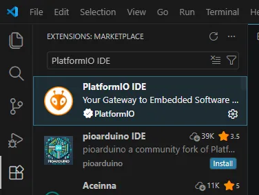
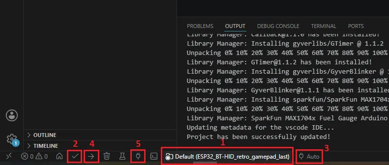

# Этап 2. Прошивка ESP32

*<u>Что понадобится</u>*:  
- модуль ESP32 **с Flash памятью**  
- USB-кабель **или** UART программатор *(в зависимости от модуля ESP32)*  

---

1. **Клонировать данный репозиторий** себе на компьютер.  

2. Скачать и установить **[VS Code](https://code.visualstudio.com/download#)**  

3. Открыть VS Code и **установить расширение PlatformIO IDE** (также по желанию Notepad++ keymap, C/C++, C/C++ DevTools и C/C++ Themes):
   - открыть панель расширений по значку кубиков в панели слева или через меню "View" -> "Extensions (Ctrl+Shifx+X)" и, в верхней ее части, в строке поиска ввести название плагина  
     
   *Поиск плагина PlatformIO IDE*  
   - кликнуть по требуемому элементу в списке и на странице плагина, открывшейся слева? нажать кнопку "Install"  

4. **Открыть проект** через меню "File" -> "Open folder... (Ctrl+K Ctrl+O)" **и дождаться пока** PlatformIO **загрузит** все требуемые **зависимости** (внизу справа появится окошко, а также внизу появится окно "OUTPUT")  

5. **Выбрать вариант мониторинга батареи** (подробнее см. "Этап 5") в *<u>gamepadConfig.hpp</u>*:
   ```
   // true  — использовать модуль MAX1704x (HW v1.2)
   // false — использовать резисторный делитель (HW v1.1)
   #define USE_MAX1704X_FUEL_GAGE false
   ```

6. **Выбрать тип геймпада** и, по желанию, изменить имя и серийный номер геймпада в *<u>gamepadConfig.hpp</u>*:
   ```
   // Только цифровые кнопки без аналоговых стиков/триггеров
   #define ONLY_DIGITAL_GAMEPAD
   // Наличие аналоговых стиков и триггеров (на данный момент не реализовано)
   //#define ANALOGUE_GAMEPAD
   
   ...
   
   // Имя BT-устройства
   inline constexpr std::string_view GAMEPAD_NAME = "My Gamepad 001";
   
   // Серийный номер устройства (если несколько устройств будут подключаться к одному хосту)
   inline constexpr std::string_view SERIAL_NUMBER = "001";
   ```

7. **Если для определения заряда батареи используется** встроенный ADC и **делитель напряжения на резисторах** - для каждой отдельной платы ESP32 **требуется единоразовая отладка и подгонка** значений VBAT_CALIBRATION_MV и RAW_CALIBRATION_MV (см. [Этап 5](./5.%20Voltage%20measure.md)).  

8. По нажатию **на кнопку 1** <u>в правой части статус бара</u> (нижней панели)  
   **выбрать** <u>в списке</u> появившемся <u>наверху</u> **соответствующее вашей плате ESP32 окружение**  
   По нажатию на **кнопку 2** можно провести предварительную сборку для проверки корректности окружения  
     
   *Основные элементы управления для прошивки ESP32*  

9. **Подключить к ПК** вашу **плату ESP32** USB кабелем или UART программатором  
   Для UART программатора CH340/CH341 могут потребоваться *[драйверы](https://www.wch-ic.com/downloads/ch341ser_zip.html)*  

10. По нажатию **на кнопку 3 выбрать соответствующий COM-порт**  

11. По нажатию **на кнопку 4 запустить процесс прошивки вашего ESP32**. *Для перехода в режим прошивки может потребоваться зажать кнопку BOOT, не отпуская её нажать и отпустить кнопку RESET и затем отпустить кнопку BOOT.*  
   По нажатию **на кнопку 5 можно открыть "Serial Monitor"** встроенный в IDE (например, для отладки и калибровки измерения напряжения на резистивном делителе  

12. Для экономии потребления рекомендуется **удалить** предустановленный **светодиод с платы ESP32**  