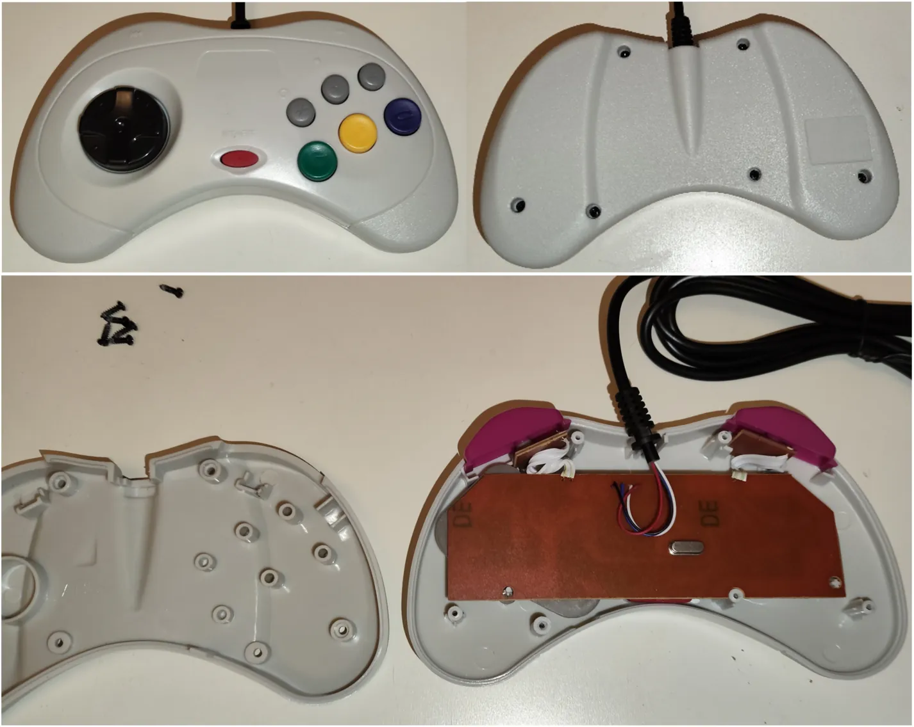
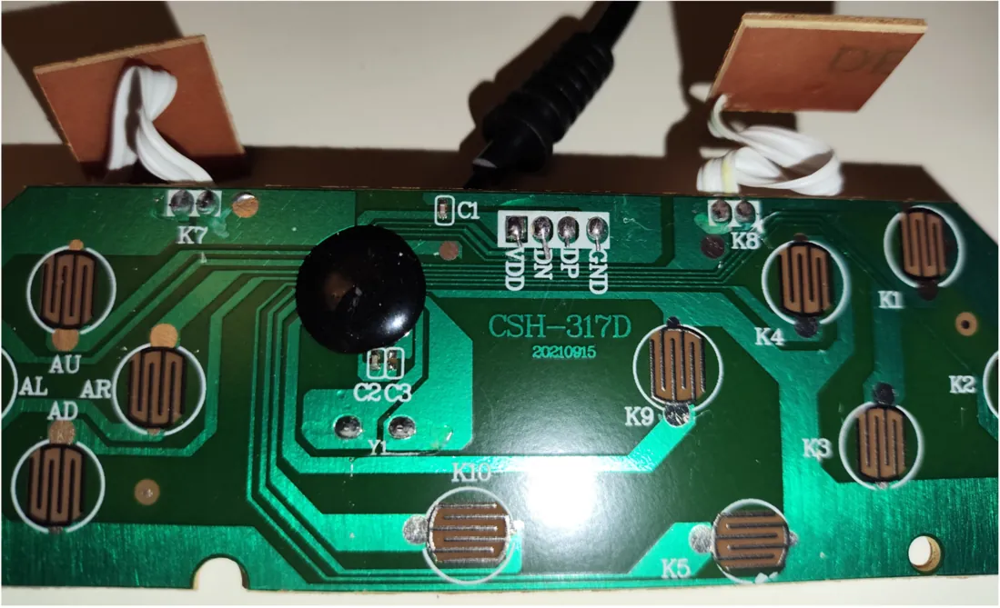
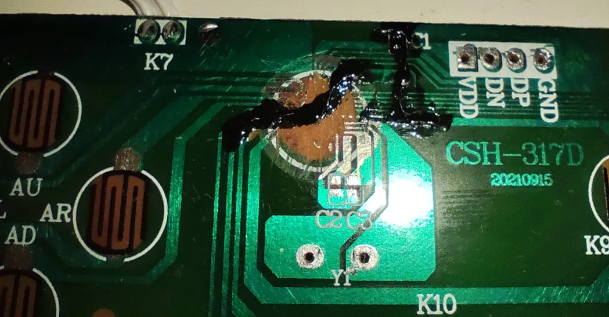
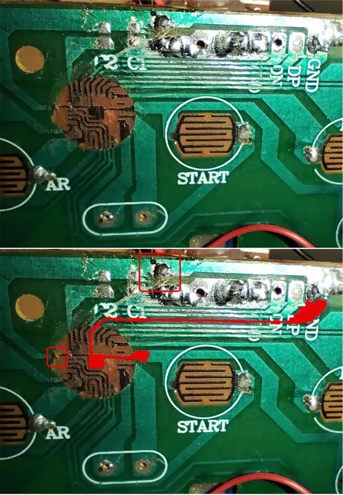
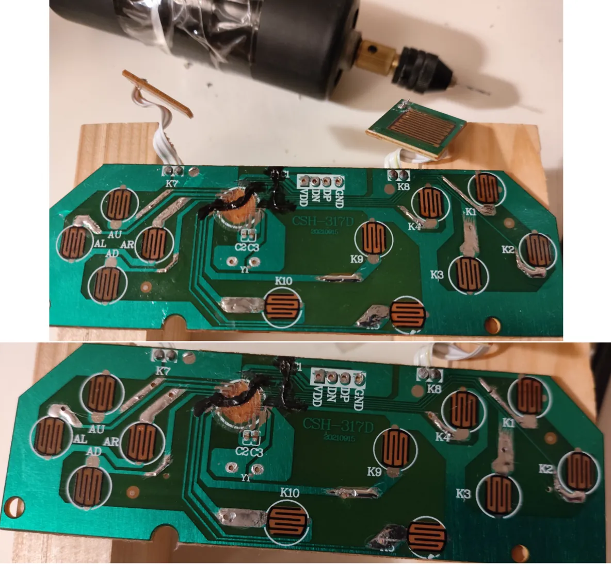
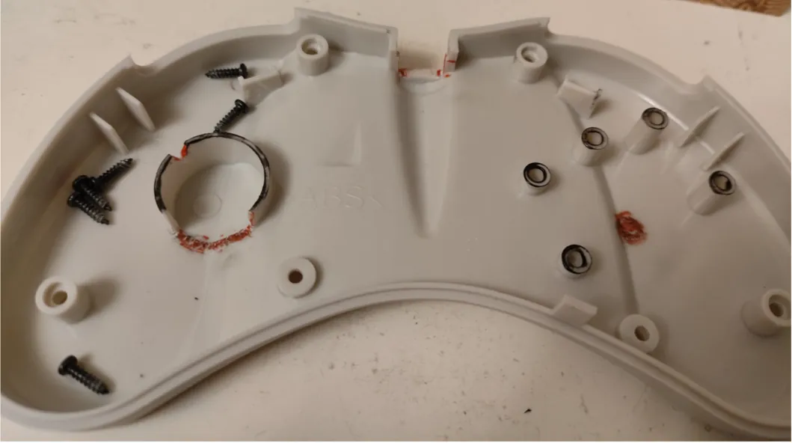
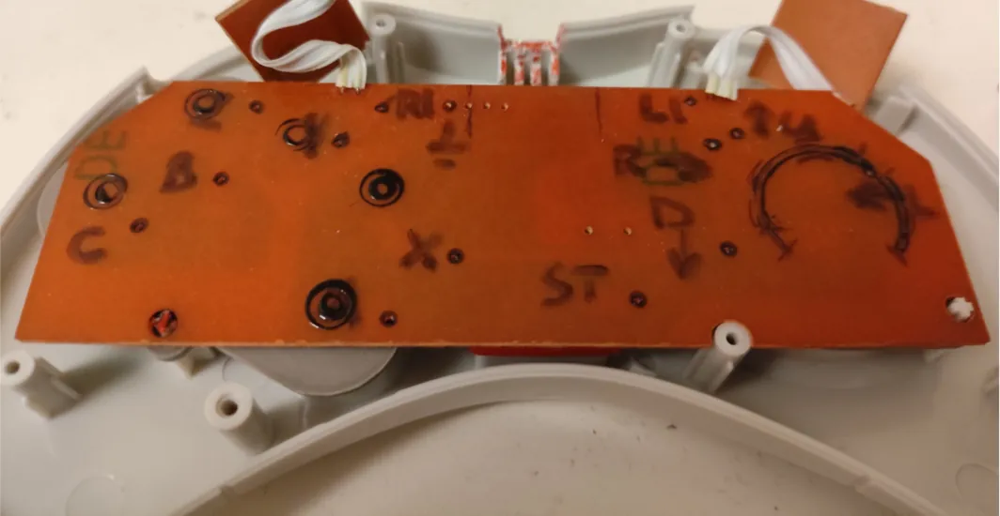

# Этап 3. Подготовка платы и корпуса геймпада

*<u>Что понадобится</u>*:  
- геймпад для переделки  
- отвертка (зачастую длинная тонкая крестовая)  
- мини дрель со сверлом 0.8–1 мм  
- паяльник (+флюс, олово, провода и средства для очистки платы)  
- мультиметр с функцией прозвонки  
- кусачки вроде Plato 170  
- алмазные надфили  

---

1. Перевернуть геймпад и открутить все болты чтобы **вскрыть корпус**.  
     
   *Вскрытие USB-геймпада (реплика геймпада Sega Saturn)*  

2. Извлечь плату из корпуса и **отпаять** внешний <u>провод</u> и <u>все компоненты</u> с платы (у меня это резонатор и конденсаторы) – легкоплавкий припой вроде Розе в помощь. Черную каплю, при наличии, **сдуть, не перегревая термофеном** и понемногу **срезать лезвием** пером.  
     
   *Плата USB-геймпада (реплика геймпада Sega Saturn)*  

3. **Проверить** что земля (контакт, помеченный **GND**) звонится **мультиметром на один из контактов всех кнопок** (не забыть и про L1/R1).  
     
   *Не самое удачное удаление черной капли и восстановление GND дорожки*  
     
   *Геймпад Sega MD2, где дорожка справа осталась цела, а вот слева пришлось пускать поверху*  

4. **Зачистить дорожку** ведущую **ко второму контакту**, не звонящемуся на землю, у каждой кнопки. Желательно зачищать в довольно широком месте подальше от места прижима резинки, чтобы не повредить её о место пайки во время использования геймпада. Также это исключит вероятность повреждения графитового напыления контакта на плате во время зачистки маски на плате.  

5. **Залудить** каждую зачищенную площадку **и просверлить**, подготовив место под пайку провода.  
     
   *Зачищенные, покрытые припоем и просверленные площадки под пайку проводов от кнопок*  

6. **Примерить платы** модуля ESP32, расширителя GPIO и плату зарядки, например, TP4056 (если используется) в корпус геймпада, **чтобы определить их расположение** с наименьшей модернизацией корпуса, ведь в задней крышке геймпада есть специальные штырьки, прижимающие плату во время нажатия кнопок. Т.е. сначала проще примерить в заднюю крышку, а затем на плату.
Место выхода провода наружу обычно использую под установку плексигласа и соответственно индикацию, а низ геймпада (противоположную точку) для вывода Type C гнезда зарядки аккумулятора. Либо как в геймпадах Saturn совмещаю место выхода зарядки и индикационного окошка.  
   
   **Лайфхак**: чтобы понимать, как располагаются места удержания платы при закрытом корпусе, нужно покрасить цветным лаком для ногтей (или аналогичной краской) места прижима платы к задней крышке и не дожидаясь высыхания закрыть корпус геймпада удерживая половинки. Чтобы лучше отпечатались метки мест прижима – нажать кнопки создавая лучшее соприкосновение.

7. **Подрезать** тонкими **кусачками** вроде Plato 170 **и довести надфилями** до ровной поверхности <u>видимые снаружи места</u>.  
     
   *Задняя крышка: чёрный глянцевый лак – места прижатия платы, красное – отрезанные части корпуса*  
     
   *Передняя крышка: чёрный глянцевый лак – места прижатия задней крышки, красное – отрезанные и доведенные надфилями части корпуса*  