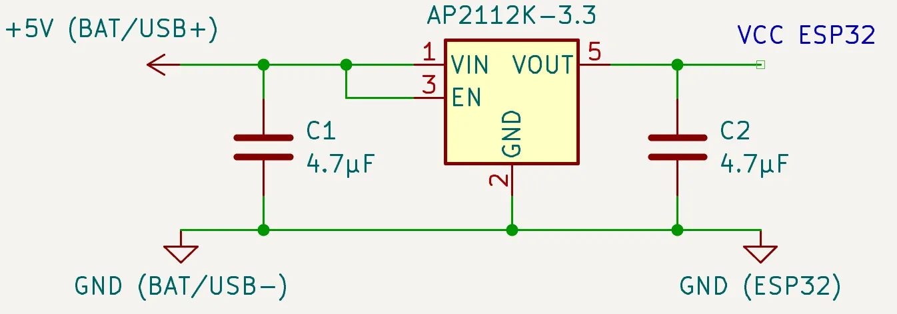
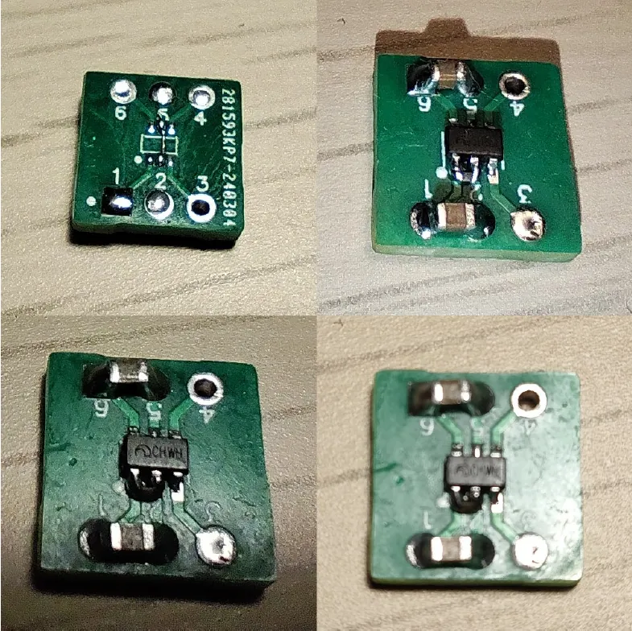

# Этап 4.1. Сборка стабилизатора напряжения (LDO)

*<u>Что понадобится</u>*:  
- один из подходящих стабилизаторов напряжения на 3.3В
- керамические конденсаторы для обвязки (2 штуки 1 - 10мкФ, оптимально каждый 2.2 - 4.7мкФ ≥10В X5R/X7R)
- макетная плата или текстолит
- паяльник (+флюс, олово, провода и средства для очистки платы)  

---

   **Чипы ESP32 могут питаться** от напряжения в крайне ограниченном диапазоне **от 3.0 до 3.6 Вольт**. В зависимости от задачи напряжение может быть снижено: например, для Wi-Fi требуются стабильные 3.3В, а если используется только BLE - уже может быть достаточно и стабильных 3.0В.  

   Если используется модуль ESP32 **без предустановленного стабилизатора** напряжения (напр., WROOM), то остро **встает вопрос выбора LDO**. И даже если LDO есть с завода в составе платы модуля, он может оказаться крайне не экономичным и даже не подходящим чипу.  

   Ниже представлены некоторые подходящие из многочисленных вариантов LDO в корпусе SOT23-5 с фиксированным выходным напряжением и типовая схема их электронной обвязки - в вариантах SOT23-5 она практически полностью совпадает, но всегда лучше смотреть datasheet на конкретный чип.  

   | Название        | Vin, В     | Макс. Iout, мА | Dropout при 50мА, мВ | 100 мА, мВ | 150 мА, мВ | 200 мА, мВ | 300 мА, мВ | 500 мА, мВ | PSRR (подавление пульсаций)   | IQ (собств. ток), мкА        |
   |-----------------|------------|----------------|-------------------------|---------------|---------------|---------------|---------------|---------------|----------------------------------|---------------------------------|
   | RT9080-33GJ5    | 1.2 - 5.5  | 600            | 20                      | 50            | 70            | 90            | 140           | 250           | 75дБ при 1кГц                    | 2                               |
   | DS8562-33S5     | 1.2 - 6.0  | 600            | 25                      | 50            | 90            | 125           | 160           | 250           | 75дБ при 1кГц / 80дб при 100Гц   | 2                               |
   | XC6220B331MR    | 1.6 - 6.0  | 1000           | 10                      | 20            | 35            | 50            | 60            | 130           | 50дБ при 1кГц                    | 8 (PS mode) / 50 (HS mode)      |
   | XC6210B332MR    | 1.2 - 5.5  | 800            | 10                      | 20            | 40            | 50            | 80            | 130           | 70дБ при 1кГц / 50дБ при 10кГц   | 25                              |
   | TLV75733PDBVR   | 1.45 - 5.5 | 1000           | 25                      | 40            | 50            | 60            | 85            | 140           | 52дБ при 1кГц / 46дб при 100кГц  | 25                              |
   | TLV75533PDBVR   | 1.45 - 5.5 | 500            | 30                      | 35            | 50            | 65            | 90            | 150           | 52дБ при 1кГц / 46дб при 100кГц  | 25                              |
   | RT9013-33GB     | 2.2 - 5.5  | 500            | 25                      | 50            | 60            | 95            | 140           | 250           | 50дБ при 10кГц                   | 25                              |
   | ME6207C33M5G    | 2.0 - 6.5  | 800            | 20                      | 40            | 50            | 60            | 100           | 160           | 65дБ при 1кГц                    | 82                              |
   | ME6217C33M5G    | 2.0 - 6.5  | 800            | 25                      | 35            | 50            | 65            | 100           | 160           | 65дБ при 1кГц                    | 100                             |
   | XC6222D331MR-G  | 1.7 - 6.0  | 700            | 10                      | 20            | 40            | 50            | 80            | 130           | 65дБ при 1кГц                    | 100                             |
   | AP7365-33WG-7   | 2.0 - 6.0  | 600            | 30                      | 50            | 80            | 100           | 150           | 260           | 65дБ при 1кГц                    | 35                              |
   | AP7366-33W5-7   | 2.2 - 6.0  | 600            | 25                      | 40            | 50            | 65            | 105           | 175           | 75дБ при 1кГц / 55дб при 10кГц   | 60                              |
   | ME6211C33M5G    | 1.2 - 6.0  | 500            | 50                      | 100           | 170           | 230           | 390           | 680           | 70дБ при 1кГц / 62дБ при 10кГц   | 30                              |
   | AP2112K-3.3TRG1 | 2.5 - 6.0  | 600            | 20                      | 40            | 60            | 85            | 125           | 220           | 65дБ при 1кГц / 65дб при 100Гц   | 55                              |
   | WL2803E33-5     | 2.5 - 5.5  | 500            | 10                      | 25            | 35            | 50            | 75            | 130           | 65дБ при 1кГц                    | 150                             |
   | CJ6211B33M      | 1.8 - 6.0  | 500            | 25                      | 55            | 75            | 105           | 160           | 275           | 80дБ при 1кГц / 70дб при 10кГц   | 50                              |
   | SPX3819M5-3.3   | 2.5 - 16.0 | 500            | 125                     | 160           | 180           | 200           | 230           | 340           | 70дБ                             | 90                              |
   | TLV78533PDBVR   | 1.4 - 5.5  | 500            | 40                      | 75            | 110           | 145           | 210           | 400           | 60дБ при 1кГц / 56дб при 100кГц  | 70                              |
   | PJ/SL9650M33Sx  | 1.7 - 7.0  | 600            | ???                     | ???           | ???           | ???           | ???           | ~250          | 75дБ при 1кГц                    | 50                              |
   | RS3236-3.3YF5   | 1.7 - 7.5  | 500            | ???                     | ???           | ???           | ???           | ???           | 450           | 70дБ при 1кГц / 72дБ при 217Гц   | 30                              |
   | BL8568GCB5ATR33 | 2.0 - 6.0  | 500            | 50                      | 100           | 150           | 180           | 300           | 500           | 70дБ при 1кГц                    | 35                              |
   | LC1486CB5TR     | 2.5 - 6.0  | 600            | 25                      | 45            | 60            | 115           | 175           | 290           | 60дБ при 1кГц                    | 40                              |
   | MIC5219-3.3YM5  | 2.5 - 12.0 | 500            | 115                     | 155           | 175           | 205           | 260           | 350           | 75дБ при 120Гц                   | 50                              |
   | TMI6050B-33     | 2.5 - 5.5  | 600            | ???                     | ???           | ???           | ???           | ???           | ~500          | 60дБ при 1кГц                    | 75                              |
   | LM8805SF5-3.3   | 2.5 - 8.0  | 600            | 50                      | 100           | 180           | 200           | 320           | 560           | 55дБ при 100Гц                   | 50                              |

     
   *Типовая обвязка LDO (конденсаторы как можно ближе к ножкам)*  

   Такой стабилизатор напряжения удобно собрать в корпусе SOT23-5 (SOT25) на готовой макетной плате. При поиске готовых макетных плат “SOT23-6 to DIP adapter” стоит смотреть расстояние между выводами, оно должно быть равно 0.95 мм. Распространённый вариант SOP10/SOT23 (лишнее можно отрезать), реже – плата на фото ниже.

     
   *LDO преобразователь с обвязкой на плате-адаптере **SC-70** (SOT-323/SOT-343) / **SOT23-6***  