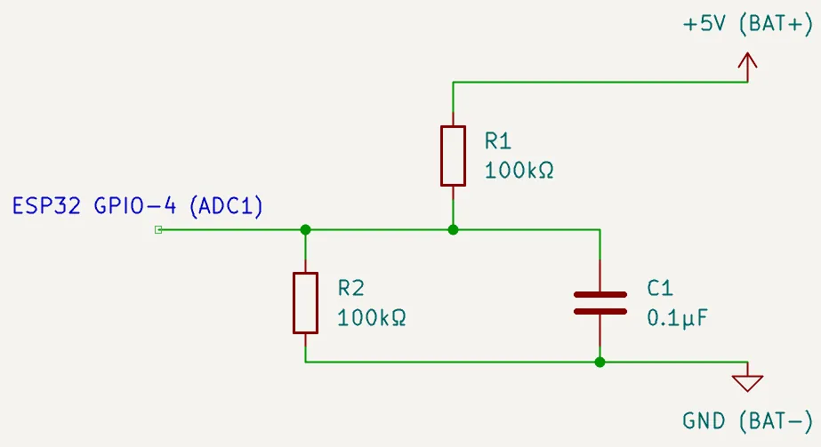
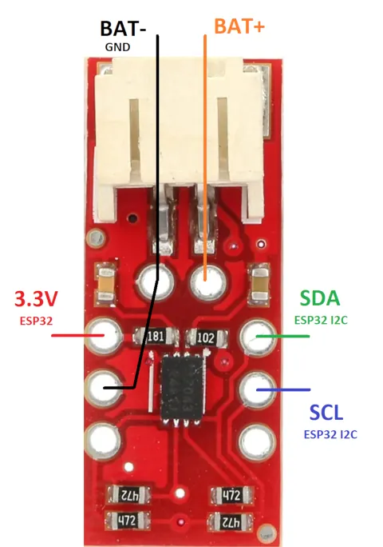

# Этап 5. Измерение напряжения аккумулятора

*<u>Что понадобится</u>*:  
- для измерения напряжения (один из вариантов):  
  - резистивный делитель (макетная плата или текстолит, 2 резистора 100 кОм и конденсатор 0,1 мкФ (он же 100 нФ))  
  - модуль MAX17043 / MAX17048
- паяльник (+флюс, олово, провода и средства для очистки платы)  

---

1. Ещё на [этапе прошивки ESP32](./2.%20Flashing%20ESP32.md) нужно было **определится со способом измерения напряжения батареи** для индикации низкого заряда и отправки процента заряда на хост:  
   - <u>делитель напряжения на резисторах</u>: дешевый, простой и миниатюрный, **занимает один GPIO - POWER_PIN** (в *<u>gamepadConfig.hpp</u>*)  
   - <u>модуль MAX1704x</u>: профессиональный, имеет программный сон, умеет измерять напряжение и оценивать процент заряда, **занимает два GPIO - SDA_PIN и SCL_PIN** (в *<u>gamepadConfig.hpp</u>*)  

2. Собрать и подключить соответствующую схему измерения напряжения к вашему модулю ESP32

   **2a.** Промежуточным этапом является *единоразовая* **калибровка** для более точного **измерения напряжения на резистивном делителе**:  
      - На время калибровки в *gamepadConfig.hpp* **установить** значение дефайна **USE_VOLTAGE_MEASURE_DEBUG == true** (*сама отладка находится в методе getBatteryVoltage_mV()* в main.cpp) **и прошить** ESP32  
      - Произвести программную калибровку путем **подстановки** в *gamepadConfig.hpp* значения **VBAT_CALIBRATION_MV** <u>измеренного мультиметром между +5V и GND</u> и **RAW_CALIBRATION_MV** взятого <u>из вывода Serial Monitor'а</u>  
      - **Установить** значение дефайна **USE_VOLTAGE_MEASURE_DEBUG == false** и далее можно **прошить** ESP32 уже финальной прошивкой  

        Для каждой новой платы калибровку нужно проводить отдельно.  
        Более точная калибровка по двум точкам требует усложнения кода и на данном этапе развития проекта не применяется.  

          
        *Схема подключения резисторного делителя (конденсатор не обязателен)*  

   **2b.** Для модуля MAX1704x прозвонкой мультиметром **убедиться что** контакт **BAT+ не звонится** на контакт **VCC**. Если проверка выявила наличие соединения - **перерезать дорожку** соединяющую эти два вывода платы.  
          
        *Схема подключения модуля MAX17043*  