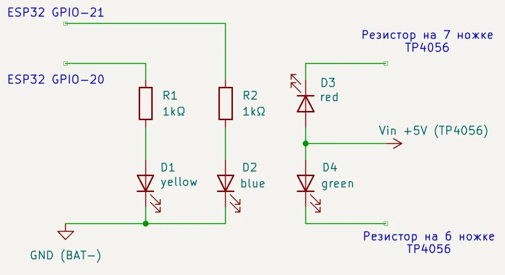
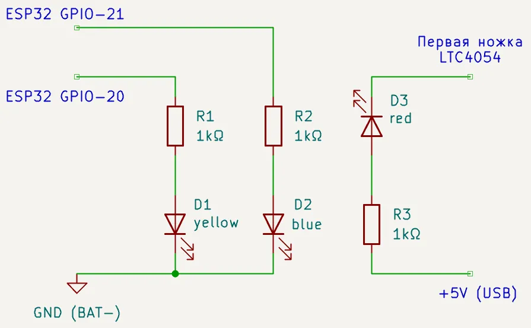
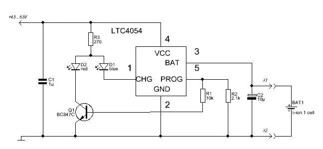
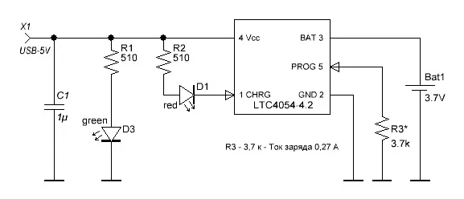

# Этап 6. Световая индикация заряда и статуса Bluetooth

*<u>Что понадобится</u>*:  
- светодиоды (например, SMD 0805) – 1 синий, 1 жёлтый, 1 красный, 1 зелёный
- резисторы для светодиодов (2 шт. 1 кОм)
- макетная плата или текстолит
- мультиметр с функцией прозвонки и проверки светодиодов
- паяльник (+флюс, олово, провода и средства для очистки платы)  

---

1. **Спаять плату индикации по схеме** ниже.

     
   *Схема платы индикации*  

     
   *Готовые платы индикации TODO*  

   Если используется предустановленный на модуле ESP32 контроллер заряда батареи LTC4054 или его аналог - скорее всего светодиод заряда потребуется лишь один красный, а схема и вовсе упростится: горит - идёт зарядка, не горит - заряжено или не подключено.  

     
   *Схема платы индикации для LTC4054*  

   Для более сложной индикации предлагаю изучить следующие схемы с индикацией полного заряда.  

     
   *Индикация для LTC4054 вар.1 ([ИСТОЧНИК](https://www.mobipower.ru/modules.php?name=News&file=article&sid=313))*  

     
   *Индикация для LTC4054 вар.2 ([ИСТОЧНИК](https://red-resistor.ru/library/trivia/charging_batt_3,7v.html))*  

   Как видно по фото готовой платы индикации – на лицевой стороне smd светодиода катод (выход/минус) помечен зеленой полоской (а DIP-светодиоды под пайку в отверстия имеют длинную ножку на аноде (вход/плюс) и больший контакт с кристаллом внутри пластиковой линзы рефлектора на просвет).

2. Если яркость светодиодов забивает друг друга, то **номинал** токоограничивающего **резистора для более тусклого** светодиода стоит **уменьшить**, а **для более яркого** можно наоборот **увеличить**:

   **$R = \frac{U - U_{led}}{I}$**  
   **U**         — напряжение питания (например, 3.3В от GPIO ESP32)  
   **$U_{led}$** — напряжение светодиода (красный, желтый, оранжевый: 1.8 - 2.2В / синий, белый, ярко-зеленый, УФ: 2.8 – 3.3В)  
   **I**         — ток светодиода в Амперах (обычно 0.02 А = 20 мА для DIP, 1 - 5 мА для SMD)  

   Также можно программно через ledc задать мощность GPIO для соответствующего светодиода, но это потребует изменения программного кода.

3. **Закрепить плату индикации** в геймпаде строго **под световодом** – местом где будет установлен плексиглас (оргстекло).  