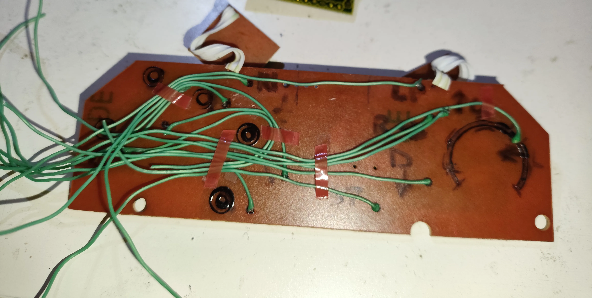
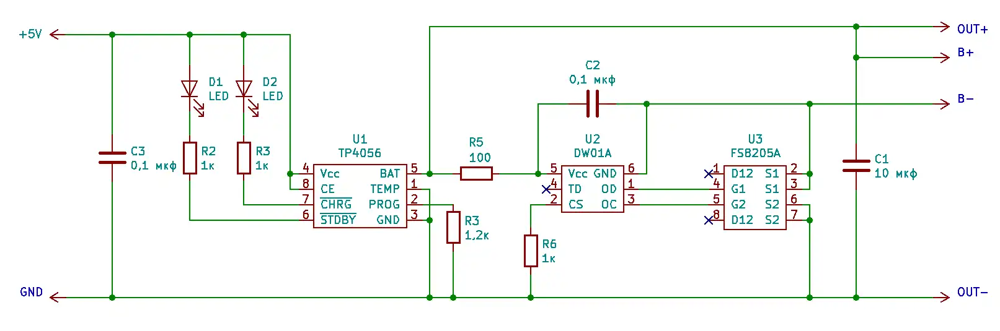
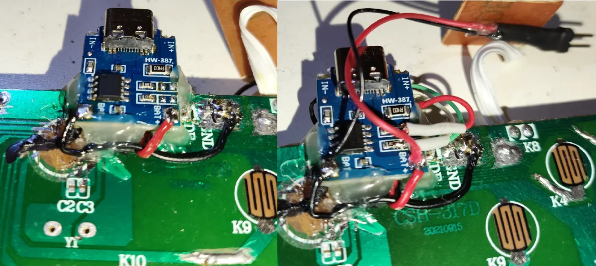

# Этап 7. Сборка геймпада (соединение модулей) 

*<u>Что понадобится</u>*:  
- все результаты предыдущих этапов
- плексиглас (оргстекло)
- инструмент для вытачивания плексигласа (напр., гравер и надфили)
- мультиметр с функцией прозвонки 
- паяльник (+флюс, олово, провода и средства для очистки платы)  

---

1. **Припаять провода к выходам всех кнопок** в места сверления платы геймпада (на Этапе 3). Провода должны быть достаточной длины, с запасом – 15-20 см будет достаточно. Нейтрального цвета, чтобы сложно было перепутать с плюсом/минусом питания, либо для удобства – разных цветов на каждую кнопку.  

   Аккуратно **разместить провода по плате**, например, закрепив на термоклей или двухсторонний скотч и сверху накрыть им же.  

     
   *Промежуточный вариант*  

2. **Приклеить** на двухсторонний скотч на свое место **плату ESP32**, примеряя её положение в геймпаде, чтобы она ничему не мешала.  

3. **Укоротить и припаять провода кнопок к** соответствующим GPIO платы **ESP32 по схеме** ниже.  

     
   *Схема подключения кнопок к GPIO*  

4. **Соединить** все **модули** проводами, а также **сделать развязку питания на плате геймпада по схеме** ниже.

     
   *Схема соединения модулей*  

     
   *Соединенные модули TODO*  

5. Судя по всему компоновка ESP32-C3 SuperMini была изменена и появились [проблемы с беспроводными интерфейсами](https://powershell.one/doneland_test/components/microcontroller/families/esp/esp32/developmentboards/esp32-c3/c3supermini/) на новых ревизиях платы.  

   <u>Кварцевый резонатор</u> на проблемных платах <u>расположен выше границы 21 пина</u> ближе к керамической антенне, при рабочей компоновке - ниже 21 пина.  

   Поэтому крайне желательно **для проблемных ревизий платы ко входу керамической антенны** (с толстой полоской, ближе к выводу GPIO 0) **припаять провод** 1 мм сечением и ~31 мм длиной (1/4 длины волны частоты Bluetooth) для улучшения сигнала **и разместить его в стороне** от проводов кнопок и прочих компонентов. Более тонкое решение описано [тут](https://peterneufeld.wordpress.com/2025/03/04/esp32-c3-supermini-antenna-modification/).  

6. **Если используется** модуль **ESP32 с предустановленным контроллером заряда** аккумулятора **припаять контакты светодиодов** индикации заряда **к выводам LTC4054 и +5V USB** (подробнее см. Этапы 4 и 6).

   В случае **если используется** внешний модуль заряда батареи **TP4056 сначала нужно удалить светодиоды и припаять три провода** (по одному на выход каждого и один на их общий вход Vin +5V), типовая схема TP4056 представлена ниже (подробнее см. Этап 6).  

     
   *Типовая схема TP4056 с защитой ([ИСТОЧНИК](https://https://engineerpavlov.ru/training/modul-tp4056.html))*engineerpavlov.ru/training/modul-tp4056.html))*  

   **Припаять провода** для TP4056 **к точке развязки питания на плате**, **закрепить TP4056** в корпусе геймпада **и соединить точку развязки с** платой зарядки **TP4056**, также **припаять male коннектор для подключения батареи к** плюсу и минусу **TP4056**. За единую точку соединения с TP4056 на плате геймпада можно взять контакты, оставшиеся от кабеля – GND для земли, остальные объединить под плюс питания с обязательной проверкой прозвонкой мультиметра на короткое замыкание.

     
   *Добавленный и зафиксированный TP4056*  

7. **Выточить плексиглас** (оргстекло) для заполнения пустоты оставшейся от удаленного провода и будущей индикации. Полезны будут ножовка (мини пила по металлу), гравер с дисками для вырезания, войлочной насадкой и пастой ГОИ для полировки стекла, а также надфили с алмазным напылением.  

   **Лайфхак**: чтобы светодиоды были лучше видны в световоде из плексигласа – сразу под ним на корпус можно приклеить фольгу или алюминиевый скотч и закрепить его края суперклеем, чтобы со временем не было создано замыкание при случайном отклеивании проводящего материала.  

8. **Подогнать и закрепить плексиглас** (оргстекло) под закрытый корпус со всеми внутренностями геймпада. Термоклей прекрасно справляется с этой задачей.   

9. **Разместить аккумулятор** в корпусе и закрепить его, например, на двухсторонний скотч и термоклей.  

10. **Подключить аккумулятор** и собрать устройство.  